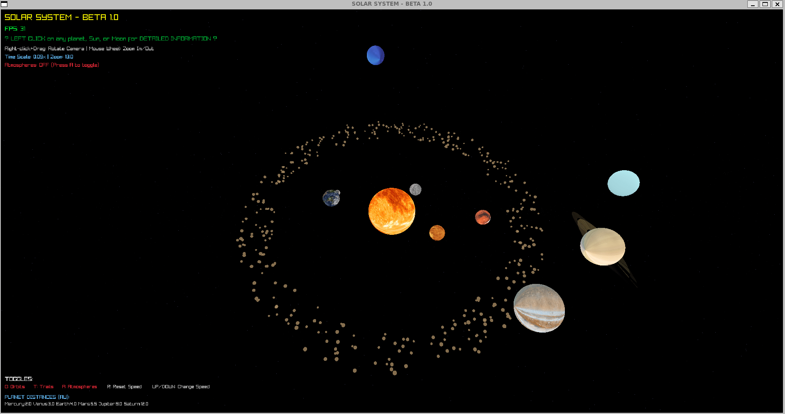

# 🌌 Solar System Simulation - Beta 1.0

[](https://opensource.org/licenses/MIT)
[](https://www.raylib.com/)
[](https://en.wikipedia.org/wiki/C11_(C_standard_revision))

An immersive, real-time 3D solar system simulation built with Raylib. Experience the beauty of our cosmic neighborhood with accurate orbital mechanics, realistic textures, atmospheric effects, and interactive exploration.



## ✨ Features

### 🌞 Celestial Bodies
- **8 Planets** - Mercury to Neptune with high-quality textures
- **The Sun** - Glowing effect with pulsating animation
- **Earth's Moon** - Orbiting our home planet
- **Asteroid Belt** - Thousands of asteroids between Mars and Jupiter

### 🎮 Interactive Controls
- **Click Selection** - Select any planet, Sun, or Moon to view detailed information
- **Free Camera** - Right-click and drag to rotate view around the solar system
- **Zoom** - Mouse wheel zoom (5-200 range) for getting incredibly close to planets
- **Time Scale** - Control simulation speed with UP/DOWN keys

### 🎨 Visual Effects
- **Realistic Atmospheres** - Toggleable atmospheric glows for planets
- **Earth's Clouds** - Rotating cloud layer over Earth
- **Saturn's Rings** - Detailed two-layer ring system
- **Planet Trails** - Orbital path visualization
- **Sun Glow** - Pulsating solar corona effect
- **Twinkling Stars** - Dynamic starfield background

### 📊 Toggleable Features
- **O** - Toggle orbit lines
- **T** - Toggle planet trails
- **A** - Toggle atmospheres
- **R** - Reset time scale
- **UP/DOWN** - Increase/decrease simulation speed

## 🚀 Getting Started

### Prerequisites

- **Linux** (Ubuntu/Debian recommended) or **WSL2** on Windows
- **Raylib** library
- **GCC** compiler
- **OpenGL** compatible GPU

### Installation

1. **Install Raylib**:
```bash
sudo apt-get install libraylib-dev